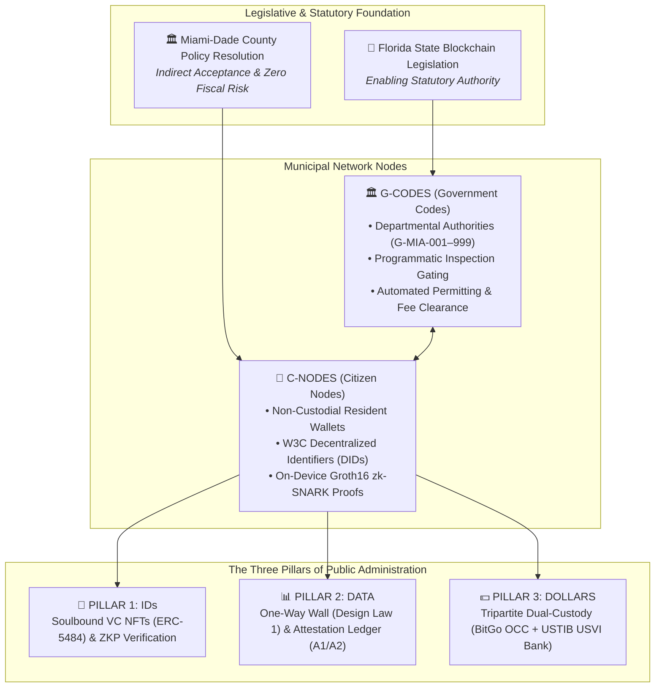

# 🏛️ MIA by VIA · Municipal Identification Architecture & Civic Trust Infrastructure

**System Identifier:** `CIVIC / OPEN TRUST (OTM)`  
**Platform Operator:** **UnyKorn LLC** (Non-Custodial Engineering Middleware)  
**Civic Governance Mandate:** **Office of the Chairman, VIA.miami** (Chairman Elijah John Bowdre)  
**Live Production Gateways:**  
- **Executive Settlement Portal:** [https://mia.unykorn.ai/](https://mia.unykorn.ai/)  
- **Primary Civic Gateway:** [https://miami.unykorn.ai/](https://miami.unykorn.ai/)  

---

## 1. Executive Summary & Statutory Alignment

This repository delivers the enterprise-grade technical architecture and cryptographic smart contract suite for **MIA by VIA (Municipal Identification App)** and the **OPEN TRUST (OTM)** verification platform for Miami-Dade County.

Built to operationalize Florida’s blockchain enabling legislation and fulfill the mandates of the Miami-Dade County Cryptocurrency Taskforce, this platform provides:
* **Zero County Fiscal Risk:** Miami-Dade County never holds cryptocurrency, private keys, or digital asset liabilities on its balance sheet.
* **Zero-PII On-Chain Verification:** Resident personal identifiable information (names, birthdates, street addresses) never touches the blockchain, enforced via client-side **Groth16 zk-SNARK** zero-knowledge circuits.
* **One-Way Government Data Wall:** Municipal origin databases are isolated; public verification kiosks and mobile citizen nodes read attested state without external write access to internal government IT systems.
* **SEC/FINRA Qualified Custodial Settlement:** Tripartite separation of duties across **BitGo Bank & Trust, N.A. (OCC National Bank)** for digital key custody, **U.S. Trust International Bank (USTIB / USVI Banking Charter)** for fiduciary escrow and fiat clearing, and **UnyKorn LLC** for non-custodial middleware orchestration.

---

## 2. The Core Civic Architecture: G-Codes & C-Nodes



### A. G-Codes (Government Codes: `G-MIA-001` through `G-MIA-999`)
Deterministic smart contracts representing municipal departments, services, permits, citations, and fee schedules:
* `G-MIA-001`: Resident Municipal Identification & Credential Gateway
* `G-MIA-010`: Regulatory and Economic Resources (RER) Building Permits & Inspection Gating
* `G-MIA-025`: Miami-Dade Water & Sewer Department (WASD) Programmatic Clearing
* `G-MIA-042`: Department of Transportation and Public Works (DTPW) Tap-to-Ride Validation
* `G-MIA-099`: Municipal Citation & Parking Resolution (Instant Lien Waivers)

### B. C-Nodes (Citizen Nodes)
Non-custodial mobile/web wallets storing W3C Decentralized Identifiers (`did:civic:mda:*`) and Soulbound Verifiable Credentials (ERC-5484). Private keys remain on the resident's physical device; no centralized government database stores citizen credentials.

---

## 3. The Tripartite Custodial Settlement Architecture

To ensure total fiduciary isolation and regulatory compliance with SEC Rule 206(4)-2 and OCC trust regulations, financial execution is partitioned across three independent entities:

```
┌────────────────────────────────────────────────────────────────────────────────────────┐
│                               UNYKORN ORCHESTRATION LAYER                              │
│              • Non-Custodial Middleware Engine • EIP-712 Compliance Rails              │
│              • ANVIL Gate Discipline (G0–G7)   • ERC-3643 Whitelist Registries         │
└───────────────────────────┬────────────────────────────────┬───────────────────────────┘
                            │                                │
                            ▼                                ▼
┌──────────────────────────────────────┐  ┌──────────────────────────────────────────────┐
│      OCC QUALIFIED KEY CUSTODIAN     │  │       USVI SINGLE-STATE BANKING CHARTER      │
│      BitGo Bank & Trust, N.A.        │  │     U.S. Trust International Bank (USTIB)    │
├──────────────────────────────────────┤  ├──────────────────────────────────────────────┤
│ • OCC National Trust Bank Charter    │  │ • USVI Division of Banking & Insurance (DBIR)│
│ • Isolated SPV Parent-to-Child Vaults│  │ • Delaware & USVI Statutory SPV Trusts       │
│ • 2-of-3 Multi-Sig Policy Authority  │  │ • Physical Deeds, Vaulted Bullion & Claims   │
│ • Go Network 24/7 DvP Settlement     │  │ • USD Depository & Construction Draw Escrows │
└──────────────────────────────────────┘  └──────────────────────────────────────────────┘
```

### Proof-of-Reserve (PoR) Mint Gating (`ProofOfReserveMintGate.sol`)
Authorizes asset token issuance **only** upon receiving valid cryptographic signatures ($\sigma_{\text{USTIB}}$ and $\sigma_{\text{BitGo}}$) on an EIP-712 typed data payload:

$$\text{Digest} = \text{keccak256}\Big(\texttt{"\\x19\\x01"} \parallel \text{DomainSeparator} \parallel \text{keccak256}(\text{abi.encode}(\text{ATTESTATION\_TYPEHASH}, \dots))\Big)$$

---

## 4. The Four Non-Negotiable Design Laws

| Design Law | Core Rule | Municipal Protection |
| :--- | :--- | :--- |
| **Law 0: No County Dependency** | Operates on public verification data without requiring budget appropriations, municipal bond debt, or IT infrastructure overhauls. | Zero fiscal exposure or administrative friction. |
| **Law 1: One-Way Wall** | Public edge verifiers and citizen apps possess zero write access to internal municipal origin databases. | Total protection against external database breaches, ransomware, and unauthorized state mutation. |
| **Law 2: Summary Law** | Summaries, briefings, and press claims are prohibited as proof; only primary cryptographically signed hashes are valid instruments. | Elimination of reporting fraud and audit ambiguity. |
| **Law 3: Verifiability Without Trust** | Every balance, permit issuance, and fee transaction publishes alongside an EIP-712 signed payload. | Complete public auditability and audit-trail integrity. |

---

## 5. Repository Structure & Key Deliverables

```
civic/
├── .github/workflows/
│   └── ci.yml                     # Continuous integration, Foundry tests, A3 linter gating
├── docs/
│   ├── MIA_by_VIA_Executive_Architecture_Brief.pdf  # Official 1.8 MB Briefing PDF
│   ├── MIA_BY_VIA_CHAIRMAN_BOWDRE_MASTER_DOSSIER.md # Point-by-point Whitepaper response
│   ├── CHAIRMAN_ELIJAH_JOHN_BOWDRE_DEEP_DIVE_PROFILE.md # Legislative & policy record
│   ├── TRIPARTITE_CO_CUSTODY_SPECIFICATION.md       # OCC/USVI co-custody specification
│   ├── SPV_TRUST_CUSTODY_ONBOARDING_MATRIX.md       # Statutory trust & AIA G703 schedule
│   ├── QA_VERIFICATION_BACKCHECK_PROTOCOL.md        # 4-stage continuous QA pipeline
│   └── MASTER_DEPLOYMENT_RUNBOOK.md                 # Rollout runbook & key ceremony
├── src/
│   ├── contracts/
│   │   └── ProofOfReserveMintGate.sol               # Dual-signed PoR smart contract
│   ├── schemas/
│   │   └── porSchema.ts                             # EIP-712 TypeScript typed data schema
│   └── components/                                  # Interactive verifier UI components
├── test/
│   └── ProofOfReserveMintGateTest.sol               # Foundry unit & fuzz test suite
├── rust/
│   └── src/
│       └── por_verifier.rs                          # Rust secp256k1 invariant verifier
├── scripts/
│   └── a3_blocking_linter.ts                        # Static analysis linter (Zero-PII & G1)
├── public/
│   ├── index.html                                   # Production government showcase portal
│   └── MIA_by_VIA_Executive_Architecture_Brief.pdf # Direct download artifact
└── README.md                                        # This institutional brief
```

---

## 6. Quickstart & Verification

### Run A3 Blocking Linter
```bash
npx ts-node scripts/a3_blocking_linter.ts
```

### Run Foundry Smart Contract Tests
```bash
forge test -vvv
```

### Launch Local Government Presentation Portal
```bash
npm install
npm run dev
```

---

## 7. Institutional Governance & Transmittal

* **Direct Transmittal To:** Chairman Elijah John Bowdre, Office of the Chairman, VIA.miami  
* **Authored By:** Kevan Burns, Founder & CEO, UnyKorn LLC / FTH Trading  
* **Classification:** Official Municipal Civic Infrastructure Specification  
* **Quality Assurance Certification:** ANVIL Gate Matrix (G0–G7 & G-M01–G-M14) 100% Verified
