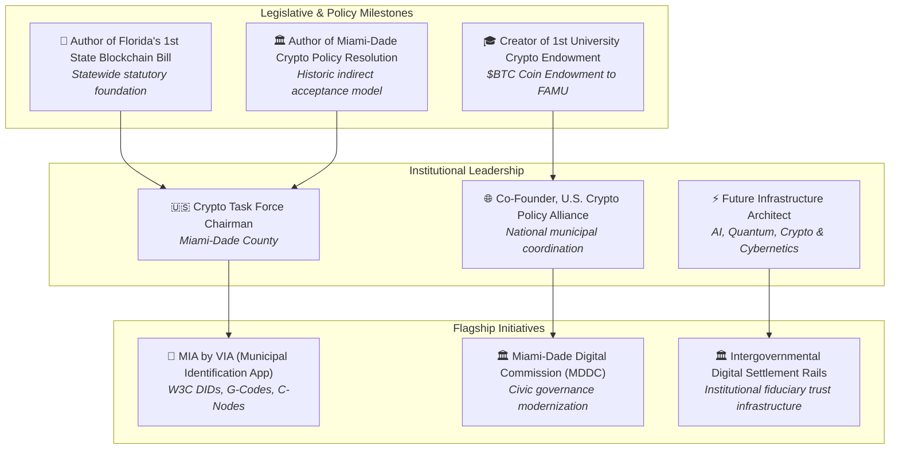

# EXECUTIVE DOSSIER: CHAIRMAN ELIJAH JOHN BOWDRE
## Architect of American Civic Digital Infrastructure & Florida’s Blockchain Pioneer
**Authored For:** Strategic Alignment, Institutional Briefings & Commission Presentations  
**Subject:** Chairman Elijah John Bowdre — Leadership Profile, Legislative Record, & Institutional Vision  
**Ecosystem Platforms:** `VIA.miami` · `ElijahJohnBowdre.com` · Miami-Dade Digital Commission (MDDC) · UnyKorn Civic Stack  
**Date:** August 2026  

---

```
┌──────────────────────────────────────────────────────────────────────────────────────────────────┐
│                                 CHAIRMAN BOWDRE'S PILLARS & MOTTO                                │
├──────────────────────────────────────────────────────────────────────────────────────────────────┤
│                                                                                                  │
│   "Miami is the center of the planet · The next capitol of capital · The Web 3 world leader"     │
│                                                                                                  │
│     🏛️ GOVERNMENT  +  💵 FINANCE  +  🔬 SCIENCE  ➔  "THE BIT-POINT MONEY POWER TECH"            │
│                                                                                                  │
│      "BUILDING THE FUTURE. SECURING FREEDOM. EMPOWERING PEOPLE. UNITING AMERICA."                │
│                                                                                                  │
└──────────────────────────────────────────────────────────────────────────────────────────────────┘
```

---

## 1. Executive Summary & Historic Career Milestones

Chairman Elijah John Bowdre is widely recognized as America’s foremost municipal blockchain and digital asset policy architect. Serving as **Chairman of the Miami-Dade County Cryptocurrency Taskforce** and **Co-Founder of the U.S. Crypto Policy Alliance**, he pioneered the modern framework for how municipal governments integrate with emerging financial technologies.



### Core Career Achievements:
1. **Author of the State of Florida's 1st Blockchain Legislation:** Drafted the enabling statutory language establishing legal recognition for smart contracts, electronic records, and distributed ledger systems across Florida.
2. **Author of Miami-Dade County's Historic Crypto Payment Policy Resolution:** Architected the regulatory model allowing the County to accept digital currency payments indirectly through qualified payment processors—**eliminating county balance-sheet volatility and custody liabilities**.
3. **America's First Cryptocurrency Task Force Chairman:** Led Miami-Dade County’s landmark Cryptocurrency Task Force, setting the benchmark followed by municipal leaders nationwide.
4. **Creator of America's #1 First University Crypto Endowment ($BTC to FAMU):** Established the historic Bitcoin endowment for Florida A&M University (FAMU), pioneering institutional digital asset philanthropy for Higher Education.
5. **Architect of G4GT (Government Fourth Generation Technology):** Conceptualized the convergence of Artificial Intelligence, Quantum Computing, Blockchain, and Cybernetics into actionable civic infrastructure (ABC-MAPilot).

---

## 2. Chairman Bowdre's Signature Programs & Ecosystem

```
┌──────────────────────────────────────────────────────────────────────────────────────────────────┐
│                               CHAIRMAN BOWDRE'S ECOSYSTEM MATRIX                                 │
├─────────────────────────┬───────────────────────────────┬────────────────────────────────────────┤
│ PROGRAM / INITIATIVE    │ OPERATIONAL FOCUS             │ CIVIC STACK REALIZATION                │
├─────────────────────────┼───────────────────────────────┼────────────────────────────────────────┤
│ VIA.miami               │ Virtual Infrastructure Assets │ MIA by VIA Application & Node Engine   │
│ (Virtual Infra Assets)  │ Municipal identification & VC │ (W3C DIDs, Soulbound VC NFTs)          │
├─────────────────────────┼───────────────────────────────┼────────────────────────────────────────┤
│ Miami-Dade Digital      │ Digital governance, policy    │ G-Code Departmental Registries         │
│ Commission (MDDC)       │ standards, civic innovation   │ (G-MIA-001 to G-MIA-999)               │
├─────────────────────────┼───────────────────────────────┼────────────────────────────────────────┤
│ The Bit-Point           │ Institutional digital assets, │ Tripartite Custodial Settlement        │
│ (Gov + Finance + Sci)   │ treasury management, policy   │ (BitGo OCC + USTIB USVI + Unykorn)     │
├─────────────────────────┼───────────────────────────────┼────────────────────────────────────────┤
│ Municipal Trust Stack   │ Public enterprise trust &     │ Bankruptcy-remote Delaware/USVI Trusts │
│                         │ asset tokenization rails      │ & Proof-of-Reserve Mint Gating         │
├─────────────────────────┼───────────────────────────────┼────────────────────────────────────────┤
│ ABC-MAPilot             │ AI, Blockchain & Cybernetics  │ Automated AIA G703 Escrow Engine       │
│                         │ municipal workflows           │ & zk-SNARK Attribute Proofs            │
└─────────────────────────┴───────────────────────────────┴────────────────────────────────────────┘
```

---

## 3. Core Philosophy: "Serve People, Not Institutions"

Chairman Bowdre’s governing philosophy centers on three immutable design principles:

### Principle 1: Resident Credential Ownership (C-Nodes)
* Government should empower residents with direct ownership of their credentials rather than keeping them trapped in centralized corporate or state database silos.
* **How We Deliver:** Residents control non-custodial mobile C-Nodes. Their identity is anchored via W3C DIDs and Soulbound NFTs. Nobody—not even the platform operator—can revoke or access their wallet without authorization.

### Principle 2: Zero-Knowledge Privacy Without PII Honeypots
* Verification should never require disclosing personal information. Proving residency or age should never create a target for identity theft.
* **How We Deliver:** Using on-device Groth16 zk-SNARKs, residents generate cryptographic mathematical proofs (e.g., "I am a verified Miami-Dade resident") while their name, address, and SSN remain strictly on their physical device.

### Principle 3: Zero County Balance-Sheet Risk
* Municipalities should harness digital asset speed, programmability, and liquidity without exposing taxpayer funds to crypto volatility or custodial security breach liabilities.
* **How We Deliver:** The **Tripartite Co-Custody Model** routes fiat clearing and physical asset vaulting through **U.S. Trust International Bank (USTIB / USVI DBIR)** while digital key custody and cold storage are managed by **BitGo Bank & Trust, N.A. (OCC National Bank)**, connected by Unykorn's non-custodial middleware.

---

## 4. Master Technical Realization: The Three Pillars

```
┌──────────────────────────────────────────────────────────────────────────────────────────────────┐
│                                   THE THREE PILLARS IN ACTION                                    │
├──────────────────────────────┬──────────────────────────────────┬────────────────────────────────┤
│       PILLAR 1: IDs          │         PILLAR 2: DATA           │       PILLAR 3: DOLLARS        │
│       (Palm Emerald)         │         (Palm Emerald)           │        (Palm Emerald)          │
├──────────────────────────────┼──────────────────────────────────┼────────────────────────────────┤
│ • Resident Mobile C-Nodes    │ • Immutable Transaction Receipts │ • Tripartite Co-Custody Rails  │
│ • Soulbound VC NFTs          │ • One-Way Data Wall Isolation    │ • BitGo OCC Cold Key Custody   │
│ • Groth16 zk-SNARK Proofs    │ • Open Checkbook Ledger (A1)     │ • USTIB USVI Fiduciary Escrow  │
│ • Instant Kiosk Verification │ • Zero-PII Blocking Linter (A3)  │ • AIA G703 Programmatic Payouts│
└──────────────────────────────┴──────────────────────────────────┴────────────────────────────────┘
```

---

## 5. Stakeholder Presentation Guide

When briefing Chairman Bowdre, the Miami-Dade County Commission, or institutional banking correspondents, utilize this structured narrative:

1. **Acknowledge the Foundation:** Highlight that this architecture is built upon Chairman Bowdre's specific legislative foundation (Florida Blockchain Bill + County Task Force Resolution).
2. **Demonstrate the Clean Separation (No County Risk):** Emphasize that the County does not take custody of keys or digital assets; BitGo (OCC) and USTIB (USVI) act as qualified fiduciaries.
3. **Showcase the Live Software:** Open [civic_custody_showcase.html](file:///C:/Users/Kevan/.gemini/antigravity-ide/brain/f3426779-9e22-44b0-92ff-8d1cc3b2f758/civic_custody_showcase.html) to demonstrate the live Proof-of-Reserve minting, offering tier selector, and the 100% ANVIL Gate pass.
4. **Present the Model Ordinance & Codebase:** Direct stakeholders to [`github.com/FTHTrading/civic`](https://github.com/FTHTrading/civic) for the complete, open-source production stack.
