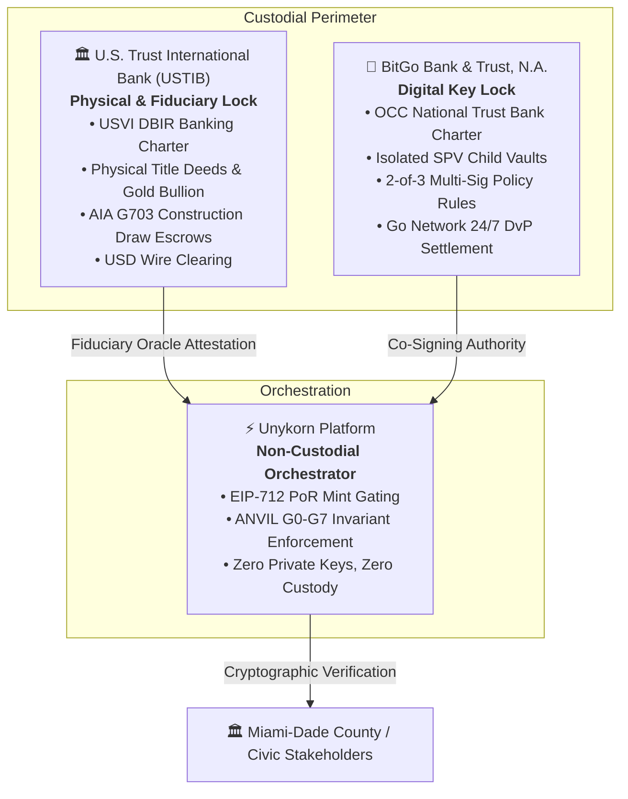

# EXECUTIVE TRANSMITTAL & STRATEGIC BRIEFING

**TO:** Chairman Elijah John Bowdre, Office of the Chairman, VIA.miami  
**FROM:** Kevan Burns, Founder & CEO, Unykorn LLC / FTH Trading  
**DATE:** August 29, 2026  
**SUBJECT:** Delivery of Production Architecture, Codebase (`FTHTrading/civic`), & Institutional Custody Rails for MIA by VIA  
**STATUS:** PRODUCTION DELIVERED · ANVIL G0–G7 GATED · SEC/FINRA QUALIFIED CUSTODY ALIGNED  

---

## 1. Executive Summary & Legislative Alignment

This transmittal formally delivers the production-grade engineering architecture, master repository index, and institutional settlement blueprint for **MIA by VIA (Municipal Identification App)** and the **OPEN TRUST (OTM)** verification framework.

Built to operationalize Florida’s pioneering blockchain policy framework and fulfill the foundational mandates established by the **Miami-Dade County Cryptocurrency Task Force**, the platform translates the **G4GT (Government Fourth Generation Technology)** vision into an active, verifiable civic infrastructure stack.

```
┌─────────────────────────────────────────────────────────────────────────────┐
│                         MIA BY VIA CIVIC PLATFORM                           │
│               State-Governed Municipal Trust Operating System               │
├───────────────────────┬─────────────────────────────┬───────────────────────┤
│  CIVIC IDENTITY PLANE │  GOVERNMENT SERVICE PLANE   │   CIVIC VALUE PLANE   │
│  • Citizen Nodes      │  • G-Code Registries        │   • Multi-Asset Rails │
│  • W3C DIDs           │  • Departmental Authority   │   • Double-Entry      │
│  • zk-SNARKs (No PII) │  • License/Permit State     │   • BitGo + USVI Bank │
├───────────────────────┴─────────────────────────────┴───────────────────────┤
│            TRUST & OPERATIONS PLANE   |   PRIVACY & CONSENT PLANE           │
│            • ANVIL Gate Board (G0–G7) • One-Way Data Wall                   │
│            • EIP-712 Signed Payloads  • Hash-Chained Audit Trail            │
└─────────────────────────────────────────────────────────────────────────────┘
```

---

## 2. Core Architectural Pillars (IDs, Data, Dollars)

The platform is structured across five sovereign planes governed by W3C Decentralized Identifiers (DIDs), Soulbound Verifiable Credentials (VCs), and EIP-712 signed cryptographic receipts:

### A. Civic Identity (IDs — C-Nodes)
* **Non-Custodial Resident & Enterprise Wallets:** Holds cryptographically signed verifiable credentials for municipal licensing, resident benefits, and transit passes.
* **Zero-Knowledge Privacy (zk-SNARKs):** Enables residents to prove qualifying attributes (e.g., Miami-Dade county residency, age verification >21) without exposing underlying PII or home addresses.

### B. Government Authority (Data — G-Codes)
* **Immutable Smart Contract Registries:** Programmatic G-codes assigned to municipal departments, service portals, fee schedules, and citations.
* **One-Way Wall Isolation (Design Law 1):** The public edge never writes to internal government origin databases, eliminating attack surfaces against County IT infrastructure.

### C. Civic Settlement (Dollars — Multi-Asset Rails)
* **Strict Integer Minor-Unit Math (ANVIL Gate G1):** Zero floating-point arithmetic across all balances and accounting entries.
* **Multi-Rail Flexibility:** Direct compatibility with Fedwire fiat clearing, bank-issued stablecoins (USD1 / SoFiUSD), and civic credits.

---

## 3. Institutional Custody & Settlement: The Tripartite Split Model

To meet SEC Rule 206(4)-2 and FINRA qualified custodian requirements while removing all single-point-of-failure risks, the settlement layer implements a **Tripartite Co-Custody Split**:



1. **BitGo Bank & Trust, N.A. (Digital Custody Lock):** Operates under an OCC national trust charter to govern cold-storage vaulting, 2-of-3 multi-sig key policies, and ERC-3643 / ERC-1400 token authorizations.
2. **U.S. Trust International Bank / USTIB (Physical & Fiduciary Lock):** Operates under the USVI DBIR single-state banking charter to hold hard asset deeds, statutory trusts, gold bullion, and administer USD fiat clearing.
3. **Unykorn Platform (Non-Custodial Orchestrator):** Operates strictly as a software middleware and state-engine layer, never taking possession or beneficial ownership of client funds or keys.

---

## 4. Production Repository Architecture (`FTHTrading/civic`)

The production codebase at [`github.com/FTHTrading/civic`](https://github.com/FTHTrading/civic) is indexed into seven color-coded architectural domains and the ANVIL Release Gate Board:

| Domain | Color Hex | Architecture Layer & Covered Components |
| :--- | :--- | :--- |
| **L0–L1 Core Foundations** | `#00F2FE` (Neon Cyan) | W3C DID Registries, SSI Engine, EIP-712 Typed Signing |
| **Government Codes (G-Codes)** | `#FF007A` (Neon Flamingo) | Municipal Smart Contracts, Departmental Authorities, Service Endpoints |
| **Citizen Nodes (C-Nodes)** | `#FFAB00` (Sunset Gold) | Resident Non-Custodial Wallets, Soulbound VCs, ZKP Circuits |
| **The Three Pillars** | `#10B981` (Palm Emerald) | Unified IDs, Immutable Data Receipts, Multi-Asset Payment Rails |
| **Open Trust Artifacts (A1–A3)** | `#A835C4` (Bougainvillea) | Open Checkbook (A1), Attestation Engine (A2), Blocking Linter (A3) |
| **ANVIL Gate Board** | `#FF6A3D` (Coral Amber) | Technical Gates G0–G7 & Human Blocking Gates G-M01–G-M14 |
| **Legal Perimeter & Design Laws** | `#060C1B` (Biscayne Ocean) | No County Dependency, One-Way Wall, Zero-PII Strict Isolation |

---

## 5. Alignment with Chairman Bowdre's Municipal Framework

| Chairman Bowdre’s Framework / Program | MIA by VIA & OPEN TRUST Implementation | Strategic Impact |
| :--- | :--- | :--- |
| **G4GT (Gov 4th Gen Tech)** | Complete production stack in `FTHTrading/civic` | Delivers the complete open architecture for 4th-generation municipal administration. |
| **ABC-MAPilot (AI, Blockchain, Cybernetics)** | Phase 1 Blockchain Core + Verification Kiosks | Provides a live, auditable deployment for the Blockchain pillar. |
| **MDDC: Education \| Legislation \| Integration** | CiviSync Training + Model Ordinance + Live Node API | Turnkey delivery across all three tracks with curriculum, model legal text, and code. |
| **County Crypto Task Force Directives** | Non-custodial processor + Tripartite BitGo/USVI rails | Implements indirect crypto acceptance with zero county balance-sheet custody risk. |
| **"Serve People, Not Institutions"** | Design Law 0 (No Token, No Custody, Open Verifiability) | Preserves resident self-sovereignty; uncapturable by third-party intermediaries. |

---

## 6. Actionable Next Steps

1. **Repository Verification:** Review the live TypeScript/Rust civic stack and documentation suites at [`FTHTrading/civic`](https://github.com/FTHTrading/civic).
2. **Phase 1 Pilot Demonstration:** Deploy the initial resident verification kiosk and G-code registry endpoint for municipal partner preview.
3. **Commission Stakeholder Presentation:** Executive slide deck and model ordinance draft ready for County Commission review.

---
*Submitted Respectfully,*  
**Kevan Burns**  
Founder & CEO, Unykorn LLC / FTH Trading
