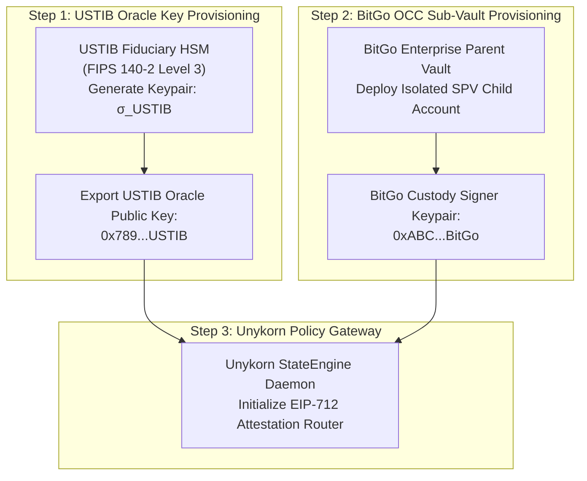

# Master Production Deployment Runbook
**Platform:** MIA by VIA · OPEN TRUST (OTM) · Civic Infrastructure Stack  
**System Architecture:** Tripartite Co-Custody (BitGo OCC + USTIB USVI + Unykorn)  
**Security Standard:** ANVIL Release Gate Protocol (G0–G7 / G-M01–G-M14)  
**Target Networks:** Base / Ethereum EVM L2 · Apostle Chain · Solana / Stellar / XRPL Anchors  

---

## 1. Pre-Deployment Key Ceremony & HSM Setup

Before deploying the smart contracts, execute the multi-party cryptographic setup:



### Key Ceremony Checklist
- [ ] **1.1 USTIB HSM Ingestion:** Generate the designated Fiduciary Attestation Key within the USTIB secure enclave. Verify that the private key is non-exportable and requires dual-officer biometric authorization.
- [ ] **1.2 BitGo Sub-Vault Creation:** Call `POST /custody/accounts` via the BitGo RWA API to deploy the isolated bankruptcy-remote SPV child vault.
- [ ] **1.3 Multi-Sig Key Allocation:** Confirm the 2-of-3 threshold policy between SPV Asset Manager, Unykorn StateEngine, and BitGo Custody.

---

## 2. Smart Contract Deployment Sequence

Deploy the `ProofOfReserveMintGate.sol` and register the compliant token registries.

### Step 2.1: Forge Deployment Command
```bash
# Environment Configuration
export RPC_URL="https://mainnet.base.org"
export DEPLOYER_PRIVATE_KEY="0x..."
export USTIB_ORACLE_SIGNER="0x789...USTIB"
export BITGO_CUSTODIAN_SIGNER="0xABC...BitGo"
export GOVERNANCE_ADMIN="0x8aced25DC8530FDaf0f86D53a0A1E02AAfA7Ac7A"

# Deploy ProofOfReserveMintGate
forge create src/contracts/ProofOfReserveMintGate.sol:ProofOfReserveMintGate \
  --rpc-url $RPC_URL \
  --private-key $DEPLOYER_PRIVATE_KEY \
  --constructor-args $USTIB_ORACLE_SIGNER $BITGO_CUSTODIAN_SIGNER $GOVERNANCE_ADMIN \
  --verify
```

### Step 2.2: Bind Token Issuance Permissions
Grant the deployed `ProofOfReserveMintGate` contract the exclusive `MINTER_ROLE` on the target ERC-3643 asset token:
```solidity
// Set Minter Role on Compliant Security Token
IERC3643Token(targetTokenAddress).grantRole(MINTER_ROLE, address(deployedGateAddress));
```

---

## 3. ANVIL Gate Sign-Off Protocol

All releases must achieve 100% sign-off across automated and human gates before mainnet activation:

```
┌─────────────────────────────────────────────────────────────────────────────┐
│                          ANVIL RELEASE GATE BOARD                           │
├─────────┬──────────────────────┬─────────────┬──────────────────────────────┤
│ Gate ID │ Verification Item    │ Type        │ Sign-Off Requirement         │
├─────────┼──────────────────────┼─────────────┼──────────────────────────────┤
│ G0      │ Spec Parity          │ Automated   │ EIP-712 schema matched       │
│ G1      │ Integer Math Check   │ Automated   │ Zero floats in finance logic │
│ G2      │ Replay Test Suite    │ Automated   │ Foundry nonces pass          │
│ G3      │ PoR Oracle Integrity │ Automated   │ Dual-sig verification passes │
│ G4      │ ZKP Zero-PII Minim.  │ Automated   │ A3 Linter clean (0 errors)   │
│ G5      │ Contract Perms       │ Automated   │ MINTER_ROLE isolated to Gate │
│ G6      │ Canary Kiosk Sync    │ Manual/Test │ 5/5 Test passes validated    │
│ G7      │ Production Live      │ Final       │ Dual Fiduciary Sign-Off      │
├─────────┼──────────────────────┼─────────────┼──────────────────────────────┤
│ G-M01   │ Legal Foundation     │ Human       │ Counsel charter review       │
│ G-M04   │ Seal/Brand Isolation │ Human       │ Compliance logo check        │
│ G-M12   │ Enabling Ordinance   │ Human       │ Municipal ordinance review   │
│ G-M14   │ Vault Reconciliation │ Human       │ Physical assay match ($0 Δ)  │
└─────────┴──────────────────────┴─────────────┴──────────────────────────────┘
```

---

## 4. Canary Node Verification & Verification Kiosk Ingestion

To validate the end-to-end integration on testnet/canary prior to general availability:

1. **Simulate Hard Asset Deposit:** Register a test assay report (1,000 troy oz gold) in the USTIB sandbox.
2. **Execute EIP-712 Attestation:** Trigger the TypeScript signer (`porSchema.ts`) to produce $\sigma_{\text{USTIB}}$ and $\sigma_{\text{BitGo}}$.
3. **Verify On-Chain Mint:** Submit the transaction to `ProofOfReserveMintGate.executeMintWithPoR()`.
4. **Scan via Resident Kiosk:** Present the Soulbound VC NFT at the physical/web verification terminal (`mia.unykorn.ai/verifier`) to confirm sub-second, zero-PII pass verification.

---

## 5. Emergency Circuit Breakers & Incident Response

| Incident Scenario | Automated Contract Trigger | Operator Action Required |
| :--- | :--- | :--- |
| **Reserve Drift ($> 0.00$)** | Global `pause()` on minting | Fiduciary audit of physical vault vs on-chain tokens. |
| **Oracle Key Compromise** | Signature rejection / Invalid v,r,s | Emergency multisig calls `updateSigners()` to rotate to standby HSM. |
| **Malicious Transaction Flooding** | Nonce mismatch revert | Rate-limiting edge proxy blocks attacker IP / DID. |
| **Regulatory Freeze Notice** | Targeted `freezeAddress()` in ERC-3643 | Compliance officer executes legal freeze on specific recipient wallet. |

---
*End of Master Deployment Runbook.*
