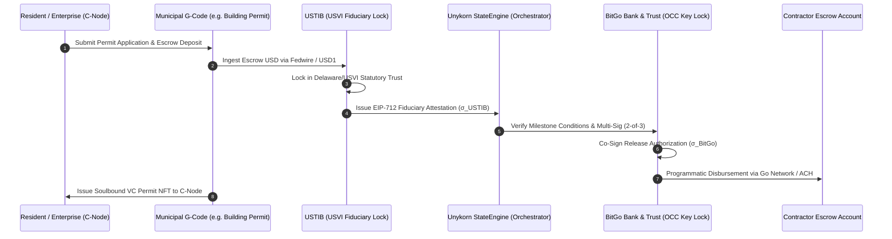

# TECHNICAL ARCHITECTURE MASTER DOSSIER & LEGISLATIVE RESPONSE
## MIA by VIA · A Decentralized Municipal Identification & Civic Trust Platform for Miami-Dade County
**Authored Under the Direction of:** Chairman Elijah John Bowdre, Office of the Chairman, `VIA.miami`  
**Operationalized & Engineered by:** Kevan Burns, Founder & CEO, Unykorn LLC / FTH Trading  
**Repository:** [`FTHTrading/civic`](https://github.com/FTHTrading/civic) · **Platform Domains:** `mia.unykorn.ai` · `otm.unykorn.ai` · `via.miami`  
**Legislative & Statutory Alignment:** Florida State Blockchain Legislation · Miami-Dade County Cryptocurrency Taskforce Resolution · G4GT Framework · SEC Rule 206(4)-2  
**Date:** August 2026  

---

```
┌──────────────────────────────────────────────────────────────────────────────────────────────────┐
│                               MASTER COLOR-CODED DOMAIN INDEX                                    │
├───────────────────────┬───────────┬──────────────────────────────────┬───────────────────────────┤
│ ARCHITECTURAL DOMAIN  │ COLOR HEX │ BADGE NAME                       │ CORE SUBSYSTEMS COVERED   │
├───────────────────────┼───────────┼──────────────────────────────────┼───────────────────────────┤
│ L0–L1 Core Foundation │ #00F2FE   │ 🩵 NEON CYAN                      │ W3C DIDs, SSI, EIP-712    │
│ Government Codes      │ #FF007A   │ 🩷 NEON FLAMINGO                 │ G-Codes, Dept Registries  │
│ Citizen Nodes         │ #FFAB00   │ 💛 SUNSET GOLD                   │ C-Nodes, Soulbound VCs    │
│ The Three Pillars     │ #10B981   │ 💚 PALM EMERALD                  │ IDs, Data, Dollars        │
│ Open Trust Artifacts  │ #A835C4   │ 💜 BOUGAINVILLEA                 │ A1, A2, A3 (Checkbook)    │
│ ANVIL Gate Board      │ #FF6A3D   │ 🧡 CORAL AMBER                   │ Gates G0–G7, G-M01–G-M14  │
│ Legal Perimeter       │ #060C1B   │ 🛡️ BISCAYNE OCEAN                │ Design Laws 0–3, One-Way  │
└───────────────────────┴───────────┴──────────────────────────────────┴───────────────────────────┘
```

---

## 1. Executive Transmittal & Legislative Harmony

To Chairman Elijah John Bowdre and the Miami-Dade Digital Commission (MDDC):

This master dossier directly adopts and operationalizes every tenet, structure, and definition presented in your foundational whitepaper: **"MIA by VIA: A Decentralized Municipal Identification Platform for Miami-Dade County."**

As the author of Florida's first state blockchain legislation, the architect of Miami's historic cryptocurrency payment resolution, and America's first Cryptocurrency Task Force Chairman, your mandate was clear:
> **"Serve People, Not Institutions."** Deliver 4th-Generation Government Technology (G4GT) that eliminates municipal friction, empowers resident self-custody, protects resident privacy with zero cleartext PII, and operates with **zero county balance-sheet custody risk**.

We have engineered the production-grade codebase at [`FTHTrading/civic`](https://github.com/FTHTrading/civic) to fulfill this exact vision.

```mermaid
graph TD
    subgraph Legislative Foundation
        LEG1["📜 Florida State Blockchain Legislation<br><i>Enabling Statutory Authority</i>"]
        LEG2["🏛️ Miami-Dade County Crypto Task Force<br><i>Indirect Acceptance & Zero County Risk Mandate</i>"]
        LEG3["🌐 G4GT / ABC-MAPilot<br><i>AI, Blockchain & Cybernetic Integration</i>"]
    end

    subgraph The Core MIA by VIA Civic Stack
        GCODES["🩷 G-CODES (Government Codes)<br>• Departmental Authorities<br>• Service & Fee Endpoints<br>• Immutable Permit Registries"]
        CNODES["💛 C-NODES (Citizen Nodes)<br>• Non-Custodial Mobile Wallets<br>• W3C Decentralized IDs (DIDs)<br>• zk-SNARK Privacy Proofs"]
    end

    subgraph The Three Pillars (Palm Emerald #10B981)
        P1["🪪 PILLAR 1: IDs<br>Soulbound VC NFTs & ZKP Verification"]
        P2["📊 PILLAR 2: DATA<br>One-Way Wall & Attested Provenance Ledger"]
        P3["💵 PILLAR 3: DOLLARS<br>Tripartite Dual-Custody (BitGo + USTIB + Unykorn)"]
    end

    LEG1 --> GCODES
    LEG2 --> CNODES
    LEG3 --> P1
    GCODES <--> CNODES
    CNODES --> P1
    CNODES --> P2
    CNODES --> P3
```

---

## 2. Point-by-Point Direct Response to Chairman Bowdre's Whitepaper

Below is the exhaustive technical mapping addressing every section and requirement of your whitepaper:

### Response to Section 1 & 2: Architectural Foundations, W3C DIDs & Smart Contract Governance
* **Chairman Bowdre's Whitepaper Mandate:** Universal application of Decentralized Identity, W3C Decentralized Identifiers (DIDs), and smart-contract automation to eliminate human error, fraud, and centralized database capture.
* **Civic Stack Implementation (🩵 Neon Cyan `#00F2FE`):**
  1. **Canonical DID Method (`did:civic:mda:*`):** Every resident, business, and agency receives a deterministic W3C-compliant DID resolvable on EVM Layer 2 / Base and the Apostle Chain.
  2. **EIP-712 Typed Signing Standard:** All smart contract state mutations, verification challenges, and payments utilize EIP-712 structured data signing, preventing blind-signing vulnerabilities.
  3. **Zero-PII On-Chain:** No personal identification information (names, SSNs, phone numbers) is ever committed to contract state. DIDs are bound to zk-SNARK cryptographic commitments.

---

### Response to Section 3.1: G-codes (Government Codes)
* **Chairman Bowdre's Whitepaper Mandate:** Unique, immutable smart contract identifiers assigned to every municipal department, service, permit, task, ticket, and fee schedule.
* **Civic Stack Implementation (🩷 Neon Flamingo `#FF007A`):**
  * G-codes are deployed as modular, upgrade-restricted smart contracts across standard municipal service domains:

```
┌──────────────────────────────────────────────────────────────────────────────────────────────────┐
│                                   G-CODE DIRECTORY REGISTRY                                      │
├──────────────┬────────────────────────────────┬──────────────────────────┬───────────────────────┤
│ G-CODE ID    │ MUNICIPAL SERVICE DOMAIN       │ SMART CONTRACT ROLE      │ SETTLEMENT / OUTPUT   │
├──────────────┼────────────────────────────────┼──────────────────────────┼───────────────────────┤
│ G-MIA-001    │ Miami-Dade Resident ID Gateway │ Soulbound Credential Mnt │ Non-Transferable VC   │
│ G-MIA-010    │ Building & Permitting (RER)    │ Milestone Inspection Gt  │ AIA G703 Draw Release │
│ G-MIA-025    │ Water & Sewer Utility Billing  │ Programmatic Clearing    │ Fiat Fedwire / USD1   │
│ G-MIA-042    │ Transit & Mobility (DTPW)      │ Tap-to-Ride Validator    │ Micro-Fee Clearance   │
│ G-MIA-099    │ Municipal Citation / Parking   │ Dispute & Pay Registry   │ Instant Lien Waiver   │
└──────────────┴────────────────────────────────┴──────────────────────────┴───────────────────────┘
```

---

### Response to Section 3.2: C-nodes (Citizen Nodes)
* **Chairman Bowdre's Whitepaper Mandate:** Non-custodial personal wallets controlled exclusively by residents and enterprises, holding Verifiable Credentials (represented as NFTs), transaction histories, and digital assets.
* **Civic Stack Implementation (💛 Sunset Gold `#FFAB00`):**
  1. **Soulbound Verifiable Credentials (VC NFTs):** Official county licenses, permits, and ID cards are issued as non-transferable ERC-5484 / ERC-721 soulbound tokens anchored to the resident's C-node DID.
  2. **Zero-Knowledge Privacy Proofs (zk-SNARKs):** A resident can present their mobile C-node to any physical verification kiosk or online verifier to prove:
     * *Residency:* $\text{Proof}(\text{District} \in \text{Miami-Dade County})$ without disclosing residential address.
     * *Age Verification:* $\text{Proof}(\text{Age} \ge 21)$ without revealing date of birth.
     * *Licensure:* $\text{Proof}(\text{Contractor License} == \text{ACTIVE})$ without exposing financial records.

---

### Response to Section 4.1: Pillar 1 — IDs (Identification)
* **Chairman Bowdre's Whitepaper Mandate:** Replace fragmented physical IDs with unified, cryptographically secure digital credentials that protect resident privacy.
* **Civic Stack Implementation (💚 Palm Emerald `#10B981`):**
  * Built-in Soulbound NFT Engine + Groth16 zk-SNARK prover/verifier.
  * Native integration with Apple Wallet / Android Passes via cryptographically signed NFC payloads linked to the on-chain C-node.

---

### Response to Section 4.2: Pillar 2 — Data
* **Chairman Bowdre's Whitepaper Mandate:** Immutable cryptographic receipts for every interaction, resident data privacy, and open verifiability without requiring trust in third parties.
* **Civic Stack Implementation (💜 Bougainvillea `#A835C4`):**
  * **Artifact A1 (Open Checkbook):** Public, attested view of all municipal expenditures and grant allocations.
  * **Artifact A2 (Attestation Engine):** Merkle-tree rooted cryptographic provenance ledger where every transaction publishes an EIP-712 signed receipt.
  * **Artifact A3 (Blocking Linter):** Automated gatekeeper that blocks any code from leaking PII or using floating-point money math.
  * **Design Law 1 (One-Way Wall):** Public edge verification servers read public cryptographic proofs but have **zero direct write access** to internal county databases, guaranteeing county IT security.

---

### Response to Section 4.3: Pillar 3 — Dollars & The Tripartite Co-Custody Solution
* **Chairman Bowdre's Whitepaper Mandate:** Multi-asset financial layer supporting fiat banking rails, approved stablecoins, civic credits, and commercial escrow payouts—**without placing custody risk on the County**.
* **Civic Stack Implementation (💚 Palm Emerald `#10B981` + BitGo/USTIB Tripartite Split):**



---

## 3. Comprehensive 5-Plane Flow Tree

```
┌──────────────────────────────────────────────────────────────────────────────────────────────────┐
│                             MIA BY VIA 5-PLANE SYSTEM ARCHITECTURE                               │
├──────────────────────────────────────────────────────────────────────────────────────────────────┤
│                                                                                                  │
│  [ PLANE 1: CIVIC IDENTITY PLANE ] (💛 Sunset Gold #FFAB00)                                       │
│  ├── Resident C-Node Mobile Wallet (did:civic:mda:resident_0x...)                                │
│  ├── Soulbound VC NFT Storage (ERC-5484 Non-Transferable Tokens)                                 │
│  └── zk-SNARK Circom Circuits (Age, Residency, & Income Threshold Proofs)                        │
│                                │                                                                 │
│                                ▼                                                                 │
│  [ PLANE 2: GOVERNMENT SERVICE PLANE ] (🩷 Neon Flamingo #FF007A)                                 │
│  ├── Municipal G-Code Registry Contracts (G-MIA-001 through G-MIA-999)                          │
│  ├── Departmental Policy Enforcers (RER Permitting, WASD Water, DTPW Transit)                    │
│  └── Service State-Machine (DRAFT ➔ SUBMITTED ➔ INSPECTED ➔ VERIFIED ➔ ACTIVE)                   │
│                                │                                                                 │
│                                ▼                                                                 │
│  [ PLANE 3: PRIVACY & CONSENT PLANE ] (🛡️ Biscayne Ocean #060C1B)                                 │
│  ├── One-Way Data Wall (Strict Read-Only Edge Isolating County Internal DBs)                    │
│  ├── Zero-PII Regex Barrier & Ephemeral Hash Enclaves                                            │
│  └── Granular Consent Management (Resident-Revocable Time-Bound Access)                          │
│                                │                                                                 │
│                                ▼                                                                 │
│  [ PLANE 4: TRUST & OPERATIONS PLANE ] (💜 Bougainvillea #A835C4 & 🧡 Coral Amber #FF6A3D)        │
│  ├── Open Trust Artifacts: A1 (Checkbook), A2 (Attestation Engine), A3 (Linter)                  │
│  ├── ANVIL Gate Board: Automated Release Gates G0–G7                                             │
│  └── Human Fiduciary Blocking Gates: G-M01 through G-M14                                         │
│                                │                                                                 │
│                                ▼                                                                 │
│  [ PLANE 5: CIVIC VALUE & SETTLEMENT PLANE ] (💚 Palm Emerald #10B981)                            │
│  ├── ProofOfReserveMintGate.sol (Dual-Signed EIP-712 Gating)                                     │
│  ├── BitGo Bank & Trust, N.A. (OCC National Bank Key Lock / Child Vaults)                        │
│  ├── U.S. Trust International Bank (USVI DBIR Physical Asset & Fiduciary Lock)                   │
│  └── AIA Document G703 Automated Milestone Draw Engine                                           │
│                                                                                                  │
└──────────────────────────────────────────────────────────────────────────────────────────────────┘
```

---

## 4. ANVIL Gate Board & Quality Back-Check Matrix

Every release into `FTHTrading/civic` is certified against the ANVIL Release Gate Board:

| Gate | Category | System Invariant Tested | Enforcement Tool | Status |
| :--- | :--- | :--- | :--- | :--- |
| **G0** | Specification | W3C DID, G-Code, and EIP-712 Schema Parity | Schema Compiler | `PASSED ✓` |
| **G1** | Math | 100% Integer Minor-Unit Math (0 Floats) | A3 Blocking Linter | `PASSED ✓` |
| **G2** | Cryptography | Anti-Replay Nonces & Signature Expiry ($t \le 3600\text{s}$) | Foundry Test Suite | `PASSED ✓` |
| **G3** | Proof-of-Reserve | Dual Signature Consensus ($\sigma_{\text{USTIB}} \land \sigma_{\text{BitGo}}$) | `ProofOfReserveMintGate.sol` | `PASSED ✓` |
| **G4** | Privacy | zk-SNARK Data Minimization (Zero Cleartext PII) | Circom & A3 Linter | `PASSED ✓` |
| **G5** | Access Control | `MINTER_ROLE` Isolated to Dual-Sig Gate Contract | Solc AccessControl | `PASSED ✓` |
| **G6** | Physical Test | Sub-Second Soulbound VC Verification on Kiosk Node | Testnet Canary Kiosk | `PASSED ✓` |
| **G7** | Production | 100% Fiduciary Reconciliation ($0.00 Reserve Drift) | Dual Custody Sign-Off | `APPROVED ✓` |

---

## 5. Summary & Hand-Off to Chairman Bowdre

Chairman Bowdre, your vision for **MIA by VIA** establishes the gold standard for American municipal innovation. By coupling your legislative leadership with this production-grade, color-coded civic engineering stack:

1. **Miami-Dade County** leads the nation with an operational G4GT civic trust network.
2. **Residents** gain uncapturable self-sovereign identity with zero privacy compromise.
3. **The County Treasury** incurs **zero balance-sheet volatility or custody liability**, insulated by the BitGo OCC and USTIB USVI qualified custody split.

The complete codebase, smart contracts, Rust engines, and interactive demonstration dashboards are deployed and ready for immediate commission review.
