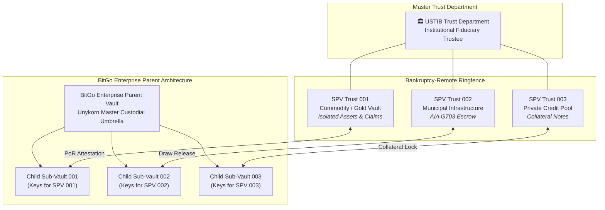
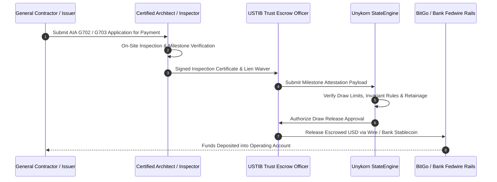

# SPV Trust & Co-Custody Onboarding Agreement Matrix
**Document Type:** Institutional Custody & Statutory Trust Governance Matrix  
**Parties:** Issuer SPV · U.S. Trust International Bank (USTIB) · BitGo Bank & Trust, N.A. · UnyKorn LLC  
**Jurisdictions:** USVI / Delaware Statutory Trust / OCC National Trust Bank  

---

## 1. Statutory Trust Entity Architecture & Bankruptcy Remoteness

Every asset-backed issuance or municipal credit fund is structured through an independent **Statutory Trust SPV** (Delaware Statutory Trust under 12 Del. C. § 3801 et seq. or USVI Statutory Trust).



### Bankruptcy Isolation Legal Covenants
1. **Separation of Legal & Beneficial Title:** Legal title to physical collateral is held by USTIB as Trustee. Beneficial interest is held by the SPV Certificate Holders / Token Holders.
2. **Non-Consolidation & Asset Isolation:** Creditors of UnyKorn LLC, the Issuer, or any other sub-trust have no legal or equitable recourse against the assets held within a designated sub-trust.
3. **OCC National Bank Protection:** Digital keys and crypto assets held in BitGo Bank & Trust child vaults are held off-balance-sheet as qualified fiduciary custody assets under OCC regulations.

---

## 2. Multi-Signature Policy & Key Authority Matrix (2-of-3)

All high-value asset movements, token mints, key rotations, and contract parameter modifications require **2-of-3 cryptographic threshold consensus**:

| Key Holder | Entity | Role & Verification Scope | Key Weight |
| :--- | :--- | :--- | :--- |
| **Key 1: SPV Asset Manager** | Issuer / Municipal Authority | Initiates business transactions, draw requests, and mint allocations. | 1 |
| **Key 2: Unykorn StateEngine** | Unykorn Policy Gateway | Automated verification of ANVIL gates, KYC/AML whitelist checks, velocity ceilings, and schema invariants. | 1 |
| **Key 3: BitGo Bank & Trust** | Qualified Key Custodian (OCC) | Independent policy check, cold-storage security approval, and final broadcast co-signing. | 1 |

### Operational Consensus Scenarios
* **Token Minting / Asset Issuance:** Requires **Key 1 (Issuer)** + **Key 2 (Unykorn StateEngine)** + valid **USTIB EIP-712 Attestation**, signed into BitGo for Key 3 co-execution.
* **Emergency Freeze / Circuit Breaker:** Can be triggered unilaterally by **Key 2 (Unykorn Engine)** or **Key 3 (BitGo Trust)** upon detected anomaly or regulatory notice.
* **Key Rotation / Policy Change:** Requires strict 3-of-3 consensus plus 48-hour time-lock.

---

## 3. Construction Draw & AIA Document G703 Escrow Disbursement Matrix

For Option 2 (Traditional Fiduciary Escrow) and Option 1 (RWA Infrastructure), capital is released against certified construction milestones:



### AIA G703 Data Mapping Schema
```json
{
  "contractorDrawApplication": {
    "projectRef": "MUNICIPAL-CIVIC-MIAMI-2026-04",
    "aiaForm": "G702_G703",
    "applicationNumber": 6,
    "periodTo": "2026-08-31",
    "contractSumToDateUSD": "12500000.00",
    "totalCompletedAndStoredUSD": "8450000.00",
    "retainagePercent": 10.0,
    "currentPaymentDueUSD": "750000.00",
    "architectCertification": {
      "certifierName": "Lead Project Engineer / Architect",
      "licenseNumber": "FL-PE-94821",
      "inspectionPassed": true,
      "lienWaiverAttached": true
    },
    "fiduciaryStatus": "APPROVED_FOR_RELEASE"
  }
}
```

---

## 4. Onboarding Checklist for New SPV Clients

- [ ] **Step 1: Entity Formation & Trust Indenture**
  - Execute Delaware/USVI Statutory Trust Agreement with USTIB Trust Department.
  - Obtain dedicated EIN and LEI for the SPV.
- [ ] **Step 2: BitGo Enterprise Sub-Vault Provisioning**
  - Generate isolated BitGo Parent-to-Child vault ID.
  - Configure 2-of-3 multi-sig policy rules and designated signer addresses.
- [ ] **Step 3: Asset Deposit & Initial Inspection**
  - Deliver physical deed, commodity receipt, or escrow funds to USTIB.
  - Complete independent appraisal and chain-of-title verification.
- [ ] **Step 4: Cryptographic Key Enrollment & PoR Pairing**
  - Register USTIB Oracle Public Key and BitGo Custody Signer with `ProofOfReserveMintGate`.
  - Issue initial dual-signed genesis attestation.
