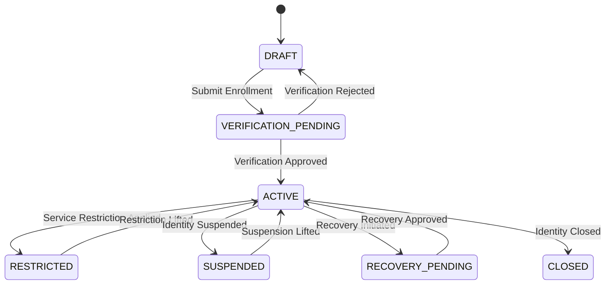
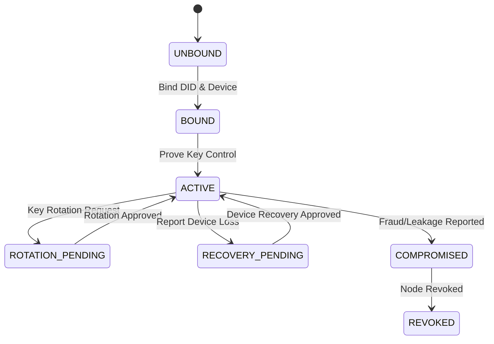
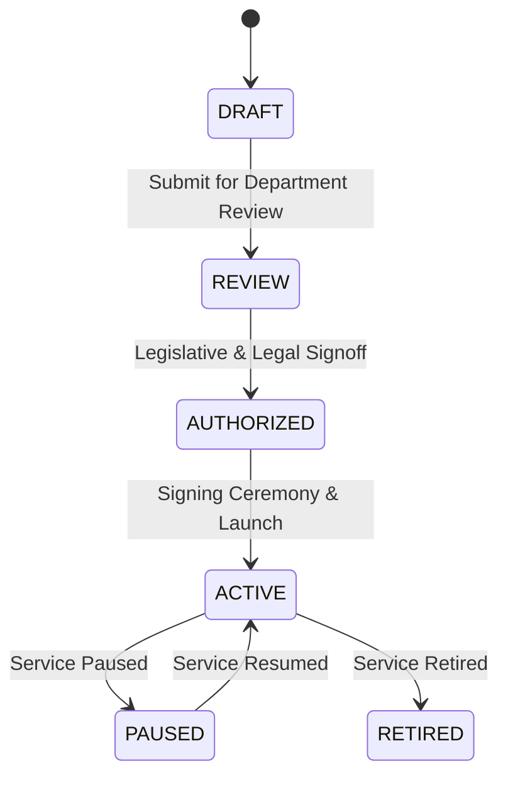
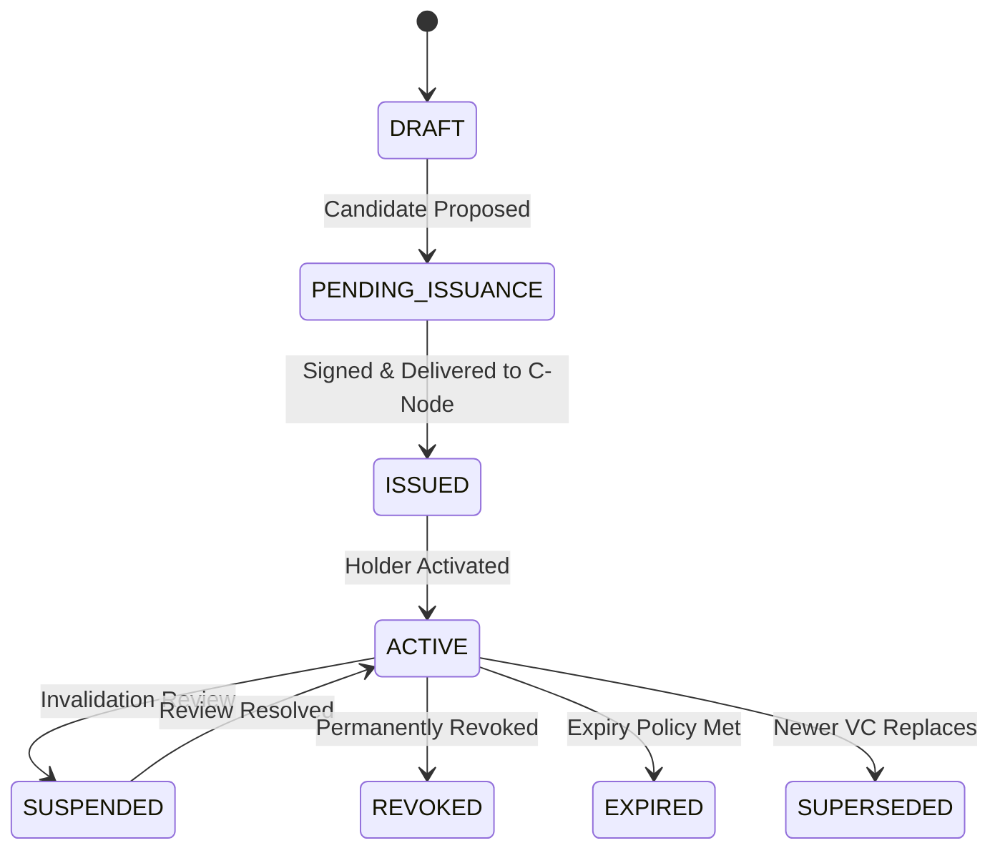

# 📑 MIA BY VIA — STATE MACHINE CATALOG
## 10 Core Aggregate State Machines & Validated Transitions

> **Operator**: UnyKorn LLC · **Domain**: `mia.unykorn.ai` · **Framework**: process-G  
> **Core Architecture**: Object + State + Allowed Transition + Evidence Receipt

---

### 1. `CitizenIdentity` Aggregate State Machine
Represents a verified resident or organizational identity profile.

---

### 2. `CitizenNode` Aggregate State Machine
Represents a citizen-controlled wallet/DID endpoint and key lifecycle.

---

### 3. `GovernmentCode` Aggregate State Machine
Defines a municipal department's authorized service, issuer, verifier, and policy profile.

---

### 4. `Credential` Aggregate State Machine
Represents a permit, license, registration, or Verifiable Credential.

---

### 5. `ProofRequest` Aggregate State Machine
Governs a selective disclosure or zero-knowledge proof request.

- `CREATED` ➔ `PRESENTED` ➔ `VERIFIED` | `DECLINED` | `EXPIRED` | `CANCELLED`

---

### 6. `AccessGrant` Aggregate State Machine
Governs time-boxed data delegation and consent rules.

- `PROPOSED` ➔ `PENDING_CONSENT` ➔ `ACTIVE` ➔ `EXPIRED` | `REVOKED`

---

### 7. `ServiceCase` Aggregate State Machine
Tracks a municipal permit, application, license, or benefit case.

- `DRAFT` ➔ `SUBMITTED` ➔ `UNDER_REVIEW` ➔ `ACTION_REQUIRED` ➔ `APPROVED` | `DENIED` ➔ `ISSUED` ➔ `CLOSED` | `APPEALED`

---

### 8. `CivicValueAccount` Aggregate State Machine
Tracks civic credits, entitlement value, or subledger accounts.

- `OPEN` ➔ `RESTRICTED` ➔ `SUSPENDED` ➔ `CLOSED`

---

### 9. `ValueInstruction` Aggregate State Machine
Controls payments, disbursements, refunds, or token movements.

- `DRAFT` ➔ `VALIDATING` ➔ `PENDING_APPROVAL` ➔ `AUTHORIZED` ➔ `SUBMITTED` ➔ `SETTLING` ➔ `SETTLED` ➔ `FAILED` | `REVERSED` | `DISPUTED`

---

### 10. `AuditReceipt` Aggregate State Machine
Records immutable operational events in `.anvil/ops.receipts.jsonl`.

- `CREATED` ➔ `SEALED` ➔ `VERIFIED` ➔ `EXCEPTION`
