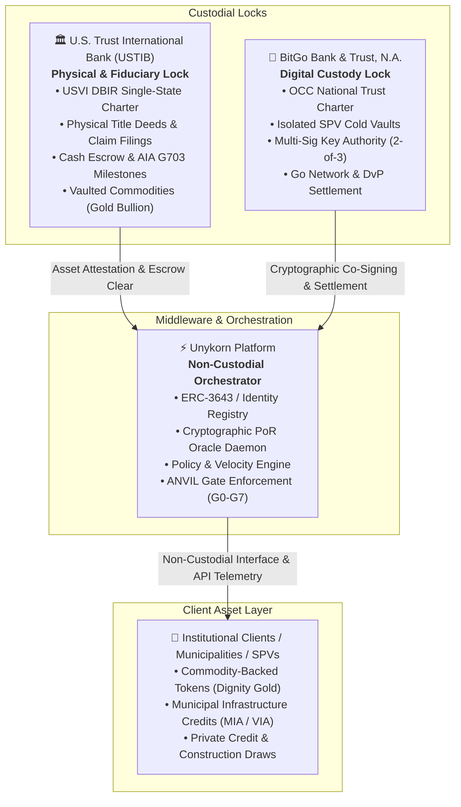
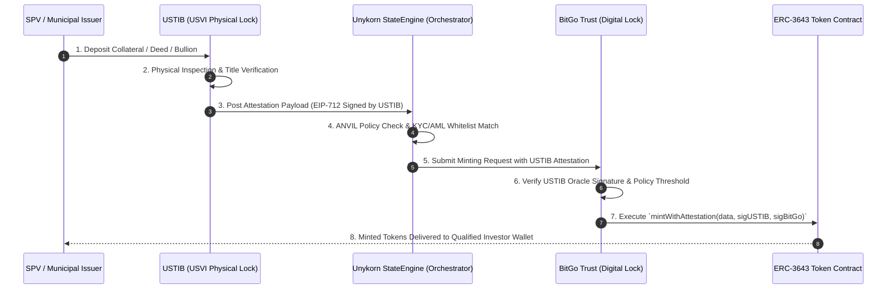
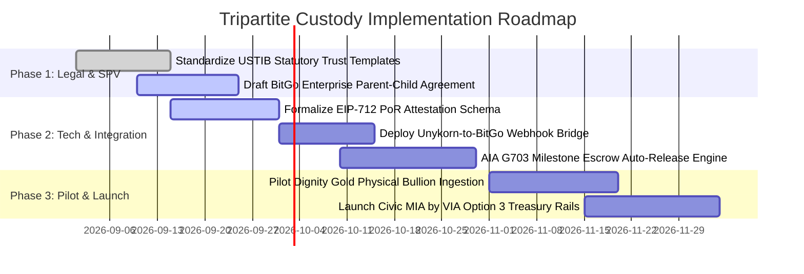

# Tripartite Co-Custody Product Specification & Institutional Brief
**Entity / Operator:** UnyKorn LLC (Non-Custodial Orchestrator)  
**Banking & Fiduciary Partner:** U.S. Trust International Bank / USVI Charter (USTIB)  
**Digital Key Custodian:** BitGo Bank & Trust, N.A. (OCC National Trust Charter)  
**Framework Version:** 2026.1-INSTITUTIONAL  
**Security & Gate Enforcement:** ANVIL G0–G7 / G-M01–G-M14 · ERC-3643 / ERC-1400  

---

## 1. Executive Summary & Dual-Custody Paradigm

The Tripartite Co-Custody framework establishes an institutional-grade, bankruptcy-remote separation of concerns between digital key custody and traditional physical/fiduciary asset administration. 



### Institutional Role Division
1. **BitGo Bank & Trust, N.A. (Digital Custody Lock):** Operates under an OCC national trust bank charter. Responsible for securing cryptographic private keys, cold-storage vaulting, 2-of-3 multi-sig policy enforcement, and compliant ERC-3643 / ERC-1400 token minting/burning upon validated multi-party consensus.
2. **U.S. Trust International Bank / USVI Charter (Physical & Fiduciary Lock):** Operates under the USVI Division of Banking and Insurance (DBIR) banking charter. Responsible for holding hard asset deeds, statutory trusts, mining claims, vaulted physical commodities, and conducting USD fiat escrow clearing.
3. **Unykorn Platform (Non-Custodial Orchestrator):** Operates purely as a software and state-engine middleware layer. Unykorn never takes possession, custody, or beneficial ownership of funds or keys.

---

## 2. Core Architectural & Technical Enhancements

### A. BitGo Technical Enhancements
* **Isolated SPV Child Vaults:** Leverage BitGo Parent Enterprise account hierarchies to spin up isolated, bankruptcy-remote sub-accounts for every municipal program, statutory trust SPV, or private credit pool.
* **Cryptographic Proof-of-Reserve (PoR) Mint Gating:** Smart contract minting covenants enforce that no tokenized asset or municipal credit can be issued on-chain without an EIP-712 co-signature from USTIB (oracle/inspection sign-off) and BitGo (authorized keyholder).
* **Policy & Velocity Engines:** Configurable multi-signature threshold policies (e.g., 2-of-3 requiring SPV Manager, Unykorn StateEngine policy check, and BitGo Trust) with daily withdrawal ceilings and automated milestone inspection dependencies.
* **Atomic DvP & 24/7 Institutional Settlement:** Direct integration with BitGo's Go Network, USD1, and qualified bank stablecoin rails for zero-counterparty-risk Delivery-vs-Payment settlement.

### B. USVI Charter (USTIB) Enhancements
* **Statutory Trust SPV Framework:** Standardized Delaware and USVI Statutory Trusts established directly within the bank's trust department to hold underlying real-world assets (e.g., gold bullion certificates, real property deeds, commodity claims).
* **Direct USD Clearing & Construction Escrow Rails:** Automated handling of fiat capital formation and AIA Document G703 construction draw distributions against certified engineering inspection verifications.
* **Dual Fiduciary Sign-Off:** USTIB acts as the qualified institutional fiduciary verifying that all statutory covenants, KYC/AML records, and chain-of-custody proofs are fulfilled before releasing fiat or signing PoR attestations.

---

## 3. Tiered Implementation & Client Offering Options

| Dimension | **Option 1: Full RWA Tripartite Suite** | **Option 2: Traditional Trust & Escrow Gateway** | **Option 3: Institutional Digital Custody** |
| :--- | :--- | :--- | :--- |
| **Primary Collateral** | Physical Assets (Real Estate, Gold, Commodities) | Cash / Fiat / Project Escrows | Digital Assets (Liquid Staked, Native L1/L2) |
| **Physical/Fiduciary Custodian** | U.S. Trust International Bank (Statutory Trust) | U.S. Trust International Bank (Escrow Agent) | None (Pure Digital Treasury) |
| **Digital Key Custodian** | BitGo Bank & Trust, N.A. (Qualified Custody) | None (Direct Banking Fedwire Rails) | BitGo Bank & Trust, N.A. (Qualified Custody) |
| **Token Standard** | ERC-3643 / ERC-1400 (Identity-Whitelisted) | None (Traditional Banking Statements) | Native Token / Cold Storage Multisig |
| **Settlement Trigger** | Dual EIP-712 Attestation (USTIB + BitGo) | AIA Document G703 / Escrow Release Schedule | Multi-Sig Quorum / Webhook Policy Gating |
| **Target Clientele** | Commodity Funds, Tokenized Real Estate, RWA | Municipalities, Construction Contractors, Lenders | Civic platforms (MIA by VIA), Digital Treasuries |
| **Orchestration Layer** | Unykorn ERC-3643 + On-Chain Compliance + Identity Registries | Unykorn StateEngine milestone verifier & draw scheduler | Unykorn Policy Gateway + Go Network settlement engine |
| **Settlement Rails** | Atomic DvP, ERC-3643, USD1 / Regulated Stablecoins | Direct Fedwire, ACH, Bank Account Escrow | Go Network 24/7 atomic internal transfer, USD1 |
| **Regulatory Standing** | SEC/FINRA Qualified Custodian + USVI Trust Banking | USVI DBIR Regulated Depository & Escrow | OCC National Bank Qualified Key Custodian |

---

## 4. Cryptographic Proof-of-Reserve (PoR) & Minting Interface

### Cryptographic Multi-Party Minting Flow


### Core API Data Payload: USTIB Proof-of-Reserve Attestation
```json
{
  "attestationVersion": "2026-v1",
  "spvId": "spv_usvi_dignity_gold_001",
  "assetType": "PHYSICAL_COMMODITY",
  "assetSubtype": "GOLD_BULLION_9999",
  "custodialDetails": {
    "fiduciary": "U.S. Trust International Bank",
    "jurisdiction": "USVI-DBIR",
    "statutoryTrustId": "TRUST-DE-USVI-7777-01",
    "vaultLocation": "USTIB-SECURE-VAULT-STT",
    "verifiedUnitCount": "100000.00",
    "unitOfMeasure": "TROY_OUNCES",
    "appraisalValueUSD": "275000000.00",
    "inspectionTimestamp": 1788004800
  },
  "compliance": {
    "kycAuditRef": "KYC-AML-USVI-89211",
    "secExemption": "REG_D_506C_REG_S",
    "transferAgentRegistry": "BitGo Transfer Agent Services"
  },
  "oracleProof": {
    "eip712Hash": "0x4b7c12a0d9...881f",
    "ustibSignature": "0x789abc...def01"
  }
}
```

---

## 5. Standardized SPV Onboarding & Implementation Roadmap



---

## 6. Institutional Executive Brief Summary (2-Page Deck Format)

### Slide 1: The Problem & The Solution
* **Institutional Dilemma:** Digital custodians cannot hold physical gold or municipal land titles; traditional charter banks cannot securely manage cryptographic keys, sub-second DvP, and smart-contract transfer restrictions.
* **The Tripartite Solution:** Combines the regulatory protections of an OCC-regulated Trust Bank (BitGo) with the physical holding power of a USVI-chartered Bank (USTIB) coordinated by Unykorn's non-custodial compliance middleware.

### Slide 2: Why This Wins Institutional Mandates
1. **Bankruptcy Remoteness:** Both digital keys and physical assets reside in dedicated statutory trusts and isolated child vaults—fully shielded from operating platform liability.
2. **Zero Naked Minting:** Cryptographic Proof-of-Reserve gating prevents issuance without verifiable fiduciary backing.
3. **Turnkey Flexibility:** Clients select between Full RWA Tripartite, Pure Escrow, or Pure Digital Custody without architectural re-engineering.
